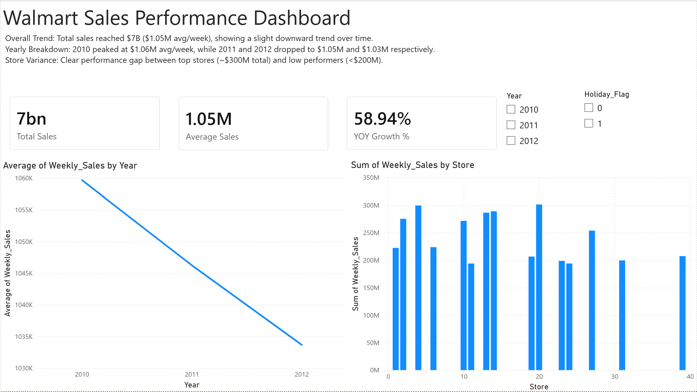
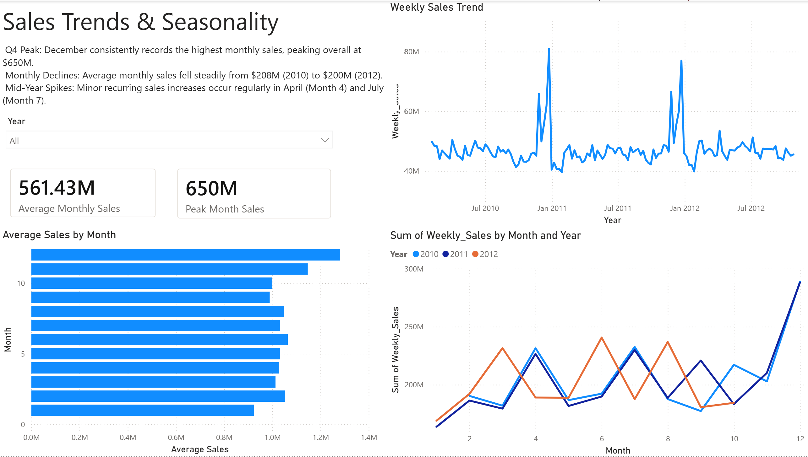
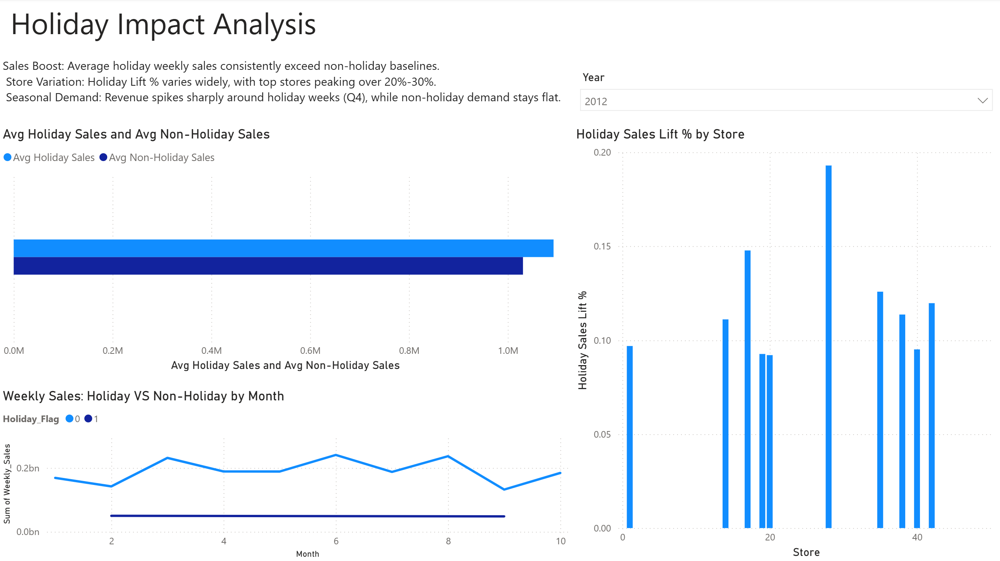
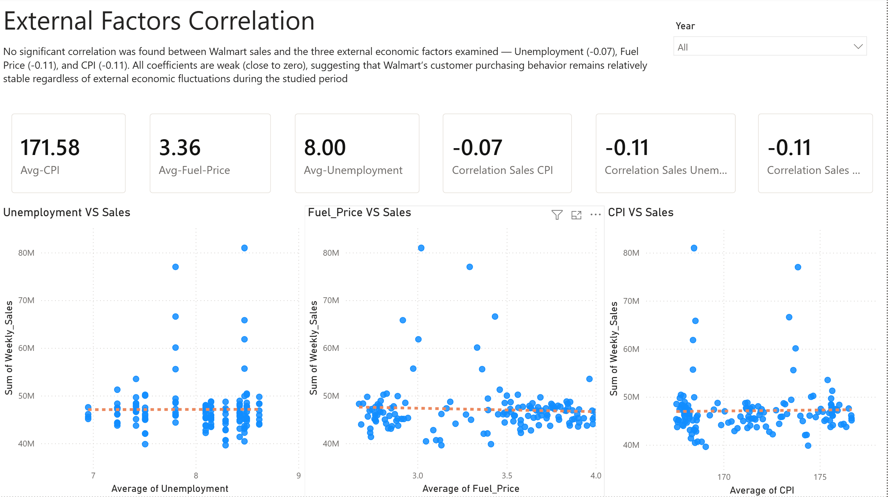
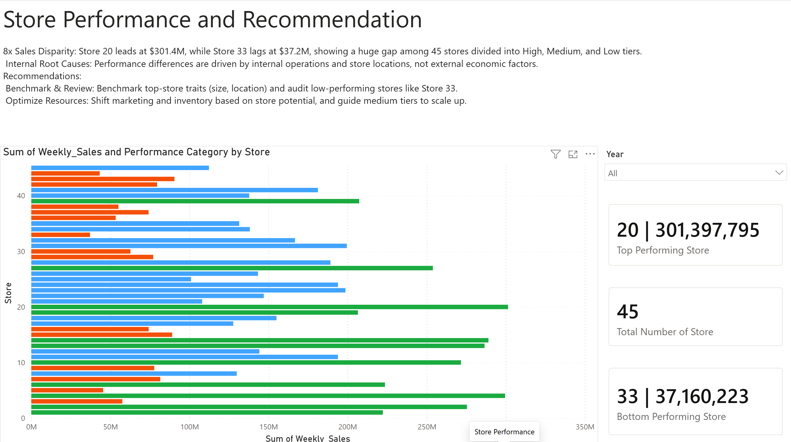

# Walmart Sales Performance & Seasonality Analysis (Power BI)

## 📌 Project Overview
This project presents an end-to-end interactive Power BI dashboard designed to analyze Walmart's overall sales performance, seasonal trends, holiday impacts, and external economic drivers. The primary goal is to evaluate store-level variances, assess promotion effectiveness, and provide actionable business recommendations to optimize revenue distribution across 45 stores.

---

## 🛠️ Tech Stack & Key Concepts
* **Business Intelligence:** Microsoft Power BI
* **Data Modeling:** Star Schema Design (Fact-Sales & Dim Tables)
* **Calculations:** DAX (Custom Measures, Dynamic Aggregations, Correlation)
* **ETL & Data Cleaning:** Power Query
* **Data Source:** Walmart Sales Dataset

---

## 📊 Dashboard Architecture & Pages
The report is structured into 5 interactive pages:

1. **Executive Overview:** High-level KPIs ($7B Total Sales, $1.05M Avg Weekly Sales) and store performance distribution.
2. **Sales Trends & Seasonality:** Monthly trends, Q4 holiday surges, and year-over-year revenue comparisons.
3. **Holiday Impact Analysis:** Evaluating sales lift percentage during promotional holiday weeks versus standard baselines.
4. **External Factors Correlation:** Statistical analysis using DAX correlation measures against CPI, Unemployment, and Fuel Price.
5. **Store Performance & Recs:** Categorizing stores into performance tiers (High, Medium, Low) and identifying operational gaps.

---

## 🔍 How to Explore
1. Download the `.pbix` file from the `reports/` folder.
2. Open it with **Power BI Desktop** to explore the fully interactive report (slicers, drill-through, tooltips).
3. Prefer a quick look? Browse the static screenshots in the `screenshots/` folder, or scroll down — they're embedded below.

---

## 💡 Key Business Insights

### 1. Overall & Seasonal Trends
* **Revenue Overview:** Total sales reached **$7B** with an average weekly sale of **$1.05M**.
* **Q4 Peak:** December consistently drives the highest monthly sales, reaching an overall peak monthly sale of **$650M**.
* **Trend Decline:** Average monthly sales experienced a subtle decline over the 3-year period (from $208M in 2010 to $200M in 2012).

### 2. Store Performance Disparity
* **8x Sales Gap:** A significant variance exists across locations—Store 20 leads at **$301.4M** total sales, while Store 33 lags at **$37.2M**.
* **Internal Drivers:** Performance differences are primarily driven by internal operational and location-specific factors rather than external macro-economic trends.

### 3. Holiday Lift Impact
* **Promotional Surge:** Holiday weeks consistently outperform non-holiday baselines.
* **Store Variation:** Holiday Sales Lift % varies greatly, with top-tier stores achieving lifts exceeding **20% to 30%**.

### 4. External Economic Factors
* **No Significant Correlation:** DAX-calculated correlation coefficients between weekly sales and CPI (-0.11), Fuel Price (-0.11), and Unemployment (-0.07) are all close to zero.
* **Business Implication:** Walmart's sales appear resilient to macro-economic fluctuations, suggesting the performance gaps between stores are driven by internal/operational factors rather than external market conditions.

---

## 🚀 Strategic Recommendations
1. **Benchmark Success:** Study top-performing store characteristics (Store 20) in terms of sizing and foot traffic to set benchmarks for low-performing stores.
2. **Operational Audits:** Perform urgent operational and marketing reviews for low-tier locations (such as Store 33).
3. **Resource Reallocation:** Shift inventory and promotional budgets strategically toward high-potential stores rather than equal distribution.
4. **Tier Progression:** Monitor medium-tier stores closely to identify growth drivers and transition them into high-performing tiers.

---

## 🖼️ Dashboard Preview

### 1. Executive Overview


### 2. Sales Trends & Seasonality


### 3. Holiday Impact Analysis


### 4. External Factors Correlation


### 5. Store Performance & Recommendations


---

## 📁 Repository Structure
```text
├── data/
│ └── Walmart_Sales_Dataset.csv
├── reports/
│ └── Walmart_Sales_Performance_Analysis.pbix
├── screenshots/
│ ├── Executive_Overview.png
│ ├── Sales_Trends.png
│ ├── Holiday_Impact.png
│ ├── External_Factors.png
│ └── Store_Performance.png
└── README.md
```

---

## 📫 Contact
[Email] ( raghad.althobaiti@outlook.sa )
